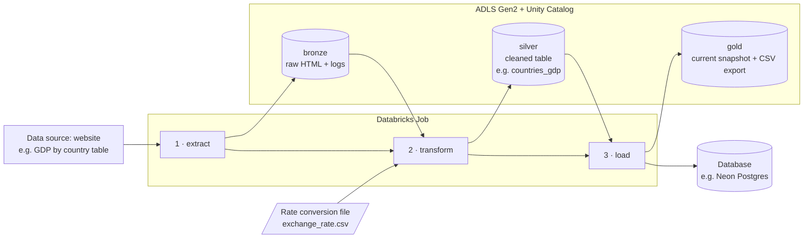

# Web Table to Warehouse — ETL Pipeline

A parameterised ETL pipeline that scrapes a table from a website, converts its values into a chosen
currency, and publishes the result to a lakehouse and a Postgres database — orchestrated as a
three-task workflow on Azure Databricks.

The source page, target table, currency and destinations are all job parameters, so the same code
runs against a different source without edits. It currently runs against a Wikipedia GDP-by-country
table.

> Inspired by a project from the IBM Data Engineering Professional Certificate. The original was a
> local script writing to a CSV file and SQLite. This version was rebuilt for the cloud:
> parameterised, orchestrated, idempotent, and secured with managed identity instead of hardcoded
> paths and keys.

---

## Architecture



Tasks hand off through storage rather than memory, so each stage can be re-run on its own — a parsing
fix can be replayed against a saved page without scraping again.

| Task | Does | Writes to |
|---|---|---|
| **extract** | Fetches the page. Nothing is parsed here. | Bronze: `page_<run_date>.html` |
| **transform** | Finds the table by column keywords, parses values and years, applies the exchange rate | Silver: one snapshot per run date |
| **load** | Publishes the current snapshot | Gold table + CSV export, and the database |

---

## Tech stack

Azure Databricks (Serverless) · Unity Catalog · ADLS Gen2 · Delta Lake · Databricks Jobs ·
Neon Serverless Postgres · Python (`requests`, `BeautifulSoup`, `pandas`, `PySpark`, `SQLAlchemy`)

---

## Repository structure

```
├── src/
│   ├── 01_extract.py      # website  -> bronze
│   ├── 02_transform.py    # bronze   -> silver
│   └── 03_load.py         # silver   -> gold + database
├── notebooks/
│   └── 01_explore_table.py   # profiling work that shaped the parsing logic
└── README.md
```

Files are in Databricks notebook source format: valid `.py` for version control, importable as
notebooks for interactive work.

---

## Configuration

Job parameters, shown with this project's defaults:

| Parameter | Example | Purpose |
|---|---|---|
| `source_url` | Wikipedia GDP (nominal) | Page to scrape |
| `table_keywords` | `Country,IMF,World Bank` | Identifies the target table by its header |
| `target_currency` | `USD` | Looked up in the rate conversion file; USD skips conversion |
| `value_scale` | `0.001` | Source units to output units (millions → billions) |
| `run_date` | `{{job.start_time.iso_date}}` | Shared by all tasks so the handoff stays aligned |
| `catalog`, `silver_table`, `gold_table`, `pg_table` | `gdp_etl_catalog`, `countries_gdp`, … | Destinations |
| `allow_schema_change` | `false` | Guard against rebuilding a table when columns change |

The rate used is stored on every row, so each snapshot records how it was produced.

---

## Design decisions

* **No credentials in code** — storage is reached through a managed identity with least-privilege access, and the database password lives in a Unity Catalog secret.
* **Idempotent** — re-running a date replaces it instead of duplicating it, which matters because scheduled jobs get retried.
* **History, not overwrite** — silver keeps one timestamped snapshot per run date, so estimate revisions can be tracked over time.
* **Source-agnostic parsing** — the table is found by column keywords and the schema is built from the page's own header; a mismatch with the existing table stops the run with a clear message.

---

## What the exploration found

Profiling the source table before rewriting the parser exposed a silent bug: some cells carry their
own estimate year (a value followed by `(2025)` where the header says 2026). Coercing those to
numbers turned them into `NaN`, so dozens of values were **dropped without any error**.

The parser now splits each cell into a value and a year, so those rows are retained and correctly
dated.

---

## Running it

Needs a Databricks workspace with Unity Catalog, an ADLS Gen2 account, and a Postgres database.
Create the catalog and medallion schemas, grant the Access Connector access to storage, upload the
rate conversion file, store the database password as a secret, then chain the three files as
`extract → transform → load` in a job with the parameters above.

---

## Possible extensions

* Pull exchange rates from an FX API instead of a static file
* A gold view comparing sources across snapshots to track revisions
* Unit tests for the parser using a saved HTML fixture, so tests never touch the network
